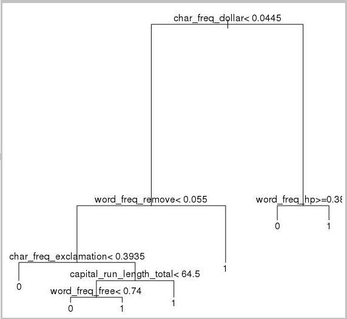

ManageX-Learn Module -- Data Scientist's Desktop -- Exercises for
LinuxDesktop

Task 1

This walkthrough shows you how to complete several common data science
tasks by using the Ubuntu Data Science Virtual Machine (DSVM). The
Ubuntu DSVM is a virtual machine image available in Azure that\'s
preinstalled with a collection of tools commonly used for data analytics
and machine learning. The DSVM image makes it easy to get started doing
data science in minutes, without having to install and configure each of
the tools individually.

In this walkthrough, we analyze the
[spambase](https://archive.ics.uci.edu/ml/datasets/spambase) dataset.
Spambase is a set of emails that are marked either spam or ham (not
spam). Spambase also contains some statistics about the content of the
emails. We talk about the statistics later in the walkthrough.

Option

-   [**X2Go**](https://wiki.x2go.org/doku.php) installed on your
    computer with an open XFCE session. For more information, see
    [Install and configure the X2Go
    client](https://docs.microsoft.com/en-us/azure/machine-learning/data-science-virtual-machine/dsvm-ubuntu-intro#x2go).

## Download the spambase dataset

The [spambase](https://archive.ics.uci.edu/ml/datasets/spambase) dataset
is a relatively small set of data that contains 4,601 examples. The
dataset is a convenient size for demonstrating some of the key features
of the DSVM because it keeps the resource requirements modest.

**Note**

This walkthrough was created by using a D2 v2-size Linux DSVM (Ubuntu
18.04 Edition). You can use a DSVM this size to complete the procedures
that are demonstrated in this walkthrough.

If you need more storage space, you can create additional disks and
attach them to your DSVM. The disks use persistent Azure storage, so
their data is preserved even if the server is reprovisioned due to
resizing or is shut down. To add a disk and attach it to your DSVM,
complete the steps in [Add a disk to a Linux
VM](https://docs.microsoft.com/en-us/azure/virtual-machines/linux/add-disk?toc=/azure/virtual-machines/linux/toc.json).
The steps for adding a disk use the Azure CLI, which is already
installed on the DSVM. You can complete the steps entirely from the DSVM
itself. Another option to increase storage is to use [Azure
Files](https://docs.microsoft.com/en-us/azure/storage/files/storage-how-to-use-files-linux).

To download the data, open a terminal window, and then run this command:

BashCopy

wget \--no-check-certificate
[https://archive.ics.uci.edu/ml/machine-learning-databases/spambase/spambase.data\
](https://archive.ics.uci.edu/ml/machine-learning-databases/spambase/spambase.data)

The downloaded file doesn\'t have a header row. Let\'s create another
file that does have a header. Run this command to create a file with the
appropriate headers:

BashCopy

echo \'word_freq_make, word_freq_address, word_freq_all,
word_freq_3d,word_freq_our, word_freq_over, word_freq_remove,
word_freq_internet,word_freq_order, word_freq_mail, word_freq_receive,
word_freq_will,word_freq_people, word_freq_report, word_freq_addresses,
word_freq_free,word_freq_business, word_freq_email, word_freq_you,
word_freq_credit,word_freq_your, word_freq_font, word_freq_000,
word_freq_money,word_freq_hp, word_freq_hpl, word_freq_george,
word_freq_650, word_freq_lab,word_freq_labs, word_freq_telnet,
word_freq_857, word_freq_data,word_freq_415, word_freq_85,
word_freq_technology, word_freq_1999,word_freq_parts, word_freq_pm,
word_freq_direct, word_freq_cs, word_freq_meeting,word_freq_original,
word_freq_project, word_freq_re, word_freq_edu,word_freq_table,
word_freq_conference, char_freq_semicolon,
char_freq_leftParen,char_freq_leftBracket, char_freq_exclamation,
char_freq_dollar, char_freq_pound,
capital_run_length_average,capital_run_length_longest,
capital_run_length_total, spam\' \> headers

Then, concatenate the two files together:

BashCopy

cat spambase.data \>\> headers\
mv headers spambaseHeaders.data

The dataset has several types of statistics for each email:

-   Columns like **word_freq\_*WORD*** indicate the percentage of words
    in the email that match *WORD*. For example, if **word_freq_make**
    is **1**, then 1% of all words in the email were *make*.

-   Columns like **char_freq\_*CHAR*** indicate the percentage of all
    characters in the email that are *CHAR*.

-   **capital_run_length_longest** is the longest length of a sequence
    of capital letters.

-   **capital_run_length_average** is the average length of all
    sequences of capital letters.

-   **capital_run_length_total** is the total length of all sequences of
    capital letters.

-   **spam** indicates whether the email was considered spam or not (1 =
    spam, 0 = not spam).

Try

\_\_\_\_\_\_\_\_\_\_\_\_\_\_\_\_\_\_\_\_\_\_\_\_\_\_\_\_\_\_\_\_\_\_\_\_\_\_\_\_\_\_\_\_\_\_\_\_\_\_\_\_\_\_\_\_\_\_\_\_\_\_\_\_\_\_\_\_\_\_\_\_\_\_\_\_

Task 2

## **Explore the dataset by using R Open**

Let\'s examine the data and do some basic machine learning by using R.
The DSVM comes with CRAN R pre-installed.

To get copies of the code samples that are used in this walkthrough, use
git to clone the Azure-Machine-Learning-Data-Science repository. Git is
preinstalled on the DSVM. At the git command line, run:

BashCopy

git clone
[https://github.com/Azure/Azure-MachineLearning-DataScience.git\
](https://github.com/Azure/Azure-MachineLearning-DataScience.git)

Open a terminal window and start a new R session in the R interactive
console. To import the data and set up the environment:

RCopy

data \<- read.csv(\"spambaseHeaders.data\")\
set.seed(123)

To see summary statistics about each column:

RCopy

summary(data)

For a different view of the data:

RCopy

str(data)

This view shows you the type of each variable and the first few values
in the dataset.

The **spam** column was read as an integer, but it\'s actually a
categorical variable (or factor). To set its type:

RCopy

data\$spam \<- as.factor(data\$spam)

To do some exploratory analysis, use the
[ggplot2](https://ggplot2.tidyverse.org/) package, a popular graphing
library for R that\'s preinstalled on the DSVM. Based on the summary
data displayed earlier, we have summary statistics on the frequency of
the exclamation mark character. Let\'s plot those frequencies here by
running the following commands:

RCopy

library(ggplot2)\
ggplot(data) + geom_histogram(aes(x=char_freq_exclamation),
binwidth=0.25)

Because the zero bar is skewing the plot, let\'s eliminate it:

RCopy

email_with_exclamation = data\[data\$char_freq_exclamation \> 0, \]\
ggplot(email_with_exclamation) +
geom_histogram(aes(x=char_freq_exclamation), binwidth=0.25)

There is a nontrivial density above 1 that looks interesting. Let\'s
look at only that data:

RCopy

ggplot(data\[data\$char_freq_exclamation \> 1, \]) +
geom_histogram(aes(x=char_freq_exclamation), binwidth=0.25)

Then, split it by spam versus ham:

RCopy

ggplot(data\[data\$char_freq_exclamation \> 1, \],
aes(x=char_freq_exclamation)) +\
geom_density(lty=3) +\
geom_density(aes(fill=spam, colour=spam), alpha=0.55) +\
xlab(\"spam\") +\
ggtitle(\"Distribution of spam \\nby frequency of !\") +\
labs(fill=\"spam\", y=\"Density\")

These examples should help you make similar plots and explore data in
the other columns.

## **Train and test a machine learning model**

Let\'s train a couple of machine learning models to classify the emails
in the dataset as containing either spam or ham. In this section, we
train a decision tree model and a random forest model. Then, we test the
accuracy of the predictions.

**Note**

The *rpart* (Recursive Partitioning and Regression Trees) package used
in the following code is already installed on the DSVM.

First, let\'s split the dataset into training sets and test sets:

RCopy

rnd \<- runif(dim(data)\[1\])\
trainSet = subset(data, rnd \<= 0.7)\
testSet = subset(data, rnd \> 0.7)

Then, create a decision tree to classify the emails:

RCopy

require(rpart)\
model.rpart \<- rpart(spam \~ ., method = \"class\", data = trainSet)\
plot(model.rpart)\
text(model.rpart)

Here\'s the result:

To determine how well it performs on the training set, use the following
code:

RCopy

trainSetPred \<- predict(model.rpart, newdata = trainSet, type =
\"class\")\
t \<- table(\`Actual Class\` = trainSet\$spam, \`Predicted Class\` =
trainSetPred)\
accuracy \<- sum(diag(t))/sum(t)\
accuracy

To determine how well it performs on the test set:

RCopy

testSetPred \<- predict(model.rpart, newdata = testSet, type =
\"class\")\
t \<- table(\`Actual Class\` = testSet\$spam, \`Predicted Class\` =
testSetPred)\
accuracy \<- sum(diag(t))/sum(t)\
accuracy

Let\'s also try a random forest model. Random forests train a multitude
of decision trees and output a class that\'s the mode of the
classifications from all the individual decision trees. They provide a
more powerful machine learning approach because they correct for the
tendency of a decision tree model to overfit a training dataset.

RCopy

require(randomForest)\
trainVars \<- setdiff(colnames(data), \'spam\')\
model.rf \<- randomForest(x=trainSet\[, trainVars\], y=trainSet\$spam)\
\
trainSetPred \<- predict(model.rf, newdata = trainSet\[, trainVars\],
type = \"class\")\
table(\`Actual Class\` = trainSet\$spam, \`Predicted Class\` =
trainSetPred)\
\
testSetPred \<- predict(model.rf, newdata = testSet\[, trainVars\], type
= \"class\")\
t \<- table(\`Actual Class\` = testSet\$spam, \`Predicted Class\` =
testSetPred)\
accuracy \<- sum(diag(t))/sum(t)\
accuracy

Try

\_\_\_\_\_\_\_\_\_\_\_\_\_\_\_\_\_\_\_\_\_\_\_\_\_\_\_\_\_\_\_\_\_\_\_\_\_\_\_\_\_\_\_\_\_\_\_\_\_\_\_\_\_\_\_\_\_\_\_\_\_\_\_\_\_\_\_\_\_\_\_\_\_\_\_\_

Task 3

##  Python 

For Python development, the Anaconda Python distributions 3.5 and 2.7
are installed on the DSVM.

**Note**

The Anaconda distribution includes
[**Conda**](https://conda.pydata.org/docs/index.html). You can use Conda
to create custom Python environments that have different versions or
packages installed in them.

Let\'s read in some of the spambase dataset and classify the emails with
support vector machines in Scikit-learn:

PythonCopy

import pandas\
from sklearn import svm\
data = pandas.read_csv(\"spambaseHeaders.data\", sep = \',\\s\*\')\
X = data.ix\[:, 0:57\]\
y = data.ix\[:, 57\]\
clf = svm.SVC()\
clf.fit(X, y)

To make predictions:

PythonCopy

clf.predict(X.ix\[0:20, :\])

To demonstrate how to publish an Azure Machine Learning endpoint, let\'s
make a more basic model. We\'ll use the three variables that we used
when we published the R model earlier:

PythonCopy

X = data\[\[\"char_freq_dollar\", \"word_freq_remove\",
\"word_freq_hp\"\]\]\
y = data.ix\[:, 57\]\
clf = svm.SVC()\
clf.fit(X, y)

Try

\_\_\_\_\_\_\_\_\_\_\_\_\_\_\_\_\_\_\_\_\_\_\_\_\_\_\_\_\_\_\_\_\_\_\_\_\_\_\_\_\_\_\_\_\_\_\_\_\_\_\_\_\_\_\_\_\_\_\_\_\_\_\_\_\_\_\_\_\_\_\_\_\_\_\_\_

Task 4 -- Python Notebook Example

[Azure-MachineLearning-DataScience/IntroToJupyterPython.ipynb at master
· Azure-Samples/Azure-MachineLearning-DataScience ·
GitHub](https://github.com/Azure-Samples/Azure-MachineLearning-DataScience/blob/master/Data-Science-Virtual-Machine/Samples/Notebooks/IntroToJupyterPython.ipynb)

-   Run thru to Azure ML start

Or on-board example

Next steps

[Sample programs & ML walkthroughs - Azure Data Science Virtual Machine
\| Microsoft
Docs](https://docs.microsoft.com/en-us/azure/machine-learning/data-science-virtual-machine/dsvm-samples-and-walkthroughs)

\_\_\_\_\_\_\_\_\_\_\_\_\_\_\_\_\_\_\_\_\_\_\_\_\_\_\_\_\_\_\_\_\_\_\_\_\_\_\_\_\_\_\_\_\_\_\_\_\_\_\_\_\_\_\_\_\_\_\_\_\_\_\_\_\_\_\_\_\_\_\_\_\_\_\_\_

Task 5 -- Framework Example

[Sample programs & ML walkthroughs - Azure Data Science Virtual Machine
\| Microsoft
Docs](https://docs.microsoft.com/en-us/azure/machine-learning/data-science-virtual-machine/dsvm-samples-and-walkthroughs#azure-machine-learning)

-   PyTorch
